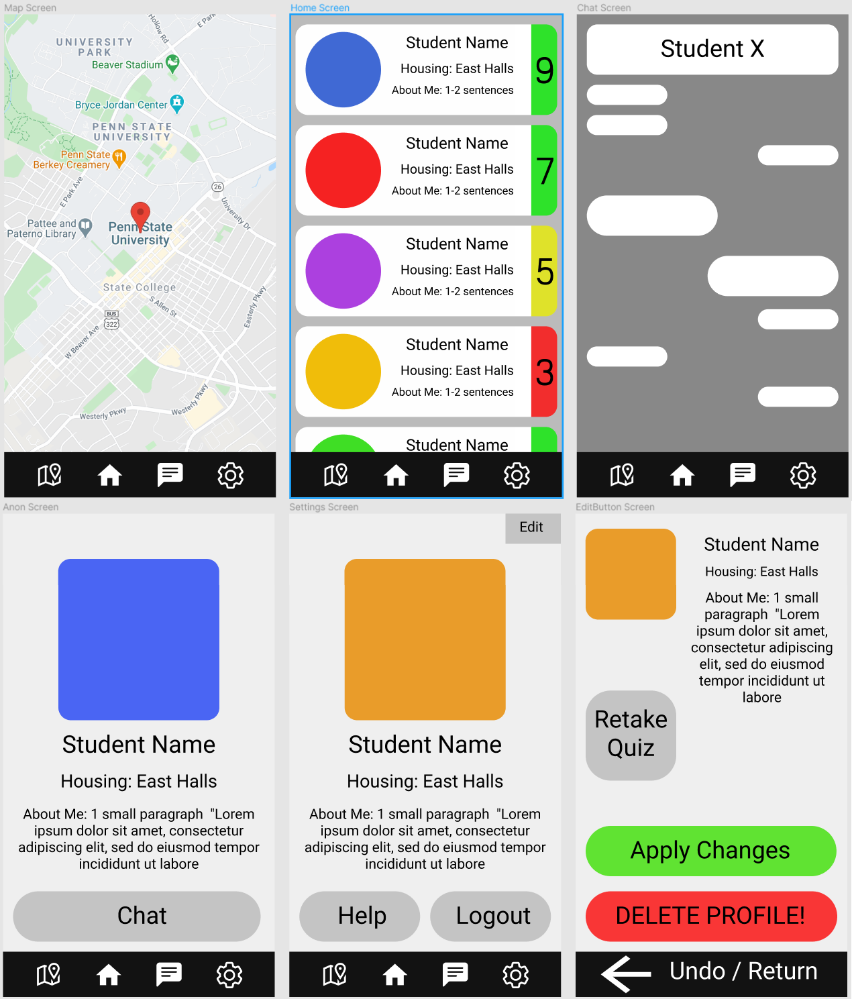
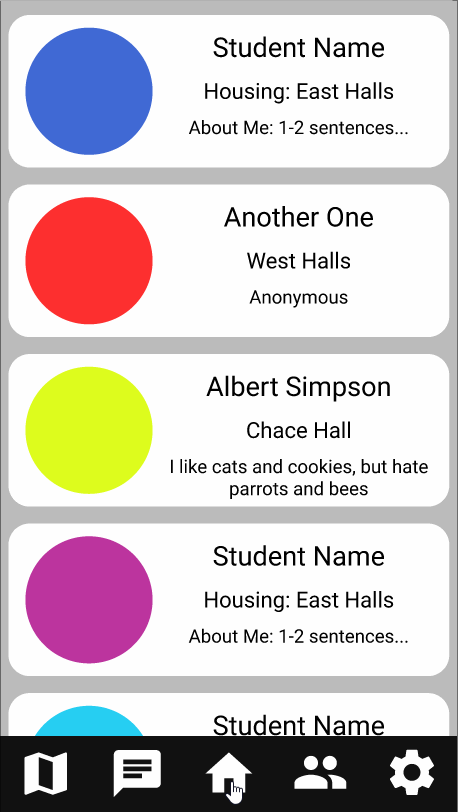

# Dormie

## Table of Contents
1. [Overview](#Overview)
1. [Product Spec](#Product-Spec)
1. [Wireframes](#Wireframes)

## Overview
### Description
An app that lets users find roommates based on compatibility on a college campus.

### App Evaluation
- **Category:** Social / Utility
- **Mobile:** Initially, functionality would be limited to mobile devices. However, application could be expanded to other devices in future updates.
- **Story:** Helps Penn State freshmen find dormmates. (up-scalable for other universities too)
- **Market:** Intended for college students.
- **Scope:** Upon first signing up, users fill out their preferences regarding potential dormmates, they will then be able to connect with other people looking for dormmates.

## Product Spec
### 1. User Stories (Required and Optional)

**Required Must-have Stories**
- [x] Use parse to store user data
- [ ] User can log in or sign up with username and password and log out
- [x] User can view a map of Penn State
- [ ] User can see a list of potential roommates (other users)
- [ ] Profile pages for each user
- [ ] User can view their profile and edit it
- [ ] User can access/retake the registration compatibility quiz
- [ ] User can use and view bottom navigation bar
- [ ] Users can make a request to connect
- [ ] User can delete their account


**Optional Nice-to-have Stories**

- [ ] User can use chat to talk to other users
- [ ] User can send a notification to another user
- [ ] User can get jpg from their phone to upload as profile picture or upload directly from camera

### 2. Screen Archetypes

* Register - User signs up or logs into their account
   * User has the option to stay signed in
* Stream - User can scroll through potential roommates
   * Detail - User can click on a tile to view detail about a potential roommate (another user)
   * Requests screen - User sees a list of users who want to connect (get access to contact information)
* Map view - User sees a map of their University (Penn State) with in-campus housing options highlighted 
* (Optional) Messaging Screen - Chat for users to communicate (direct 1-on-1)
* Profile Screen 
   * User can view their profile.
   * Allows user to edit their profile or retake the compatibility quiz. 
   * Allows user to log out or delete profile.


### 3. Navigation

**Tab Navigation** (Tab to Screen)

* Map
* Home (View potential dormmates)
* Requests
* Profile-Settings

Optional:
* Chat (or ChatBot)

**Flow Navigation** (Screen to Screen)
* Forced Log-in -> Account creation if no log in is available
* Map -> open mapview
* Home -> Find dormies
* Requests -> To check dormie requets
* Profile-Settings -> Toggle profile edit

## Wireframes
instead of penn and paper, we digitally collaborated and used paint to draw, equivalent to digital-handwritten work


### [BONUS] Digital Wireframes & Mockups


#### Updated Wireframe 


### [BONUS] Interactive Prototype


### Models

User

| Property | Type | Description |
| -------- | -------- | -------- |
| email    | String | email Id of the user(.edu) |
| ObjectID | String | Unique ID for the field |
| fullname | String	| Full name of the user |
| password | String	| Password of the user |
| displayPic|File   | Profile pic (Image) |
| aboutMe | String | About me displayed on profile
| Preferences| Pointer | Points to User's row in preference database
| Active | Boolean | Shows whether the user is active or not


Preferences
| Property | Type | Description |
| -------- | -------- | -------- |
ObjectID | String |  Unique ID for the field 
| q1 | int | Stores user's answer to preference question 1
| q2 | int | Stores user's answer to preference question 2
| q3 | int | Stores user's answer to preference question 3
|... |... |...


**Network Models**

*Login Screen
 (Read/Get) Query the user object
```
 ParseUser.logInInBackground(username, password, new LogInCallback() {
  public void done(ParseUser user, ParseException e) {
    if (user != null) {
      //user is logged in
      goMainActivity;
    } else {
      //Use a parse exception
      Log.e(TAG, "Login error")
      return;
    }
  }
});
```

 (Update) Create user on signup
 
```
 user.signUpInBackground(new SignUpCallback() {
  public void done(ParseException e) {
    if (e == null) {
      // Sign up succesful
      goMainActivity;
    } else {
      // Sign up didn't succeed. Look at the ParseException
      Log.e(TAG, "Sign up failed");
      return;
    }
  }
});
```
 
*Home Screen
Read from users database
(Read/Get) Query users

```
ParseQuery<ParseUser> query = ParseUser.getQuery();
query.findInBackground(new FindCallback<ParseUser>() {
  public void done(List<ParseUser> objects, ParseException e) {
    if (e == null) {
        // The query was successful.
        //show users on screen but not current user
    } else {
        // Something went wrong.
        Log.e(TAG, "Not able to get list of users")
        return;
    }
  }
});
```

*Map Screen
Read/Get from Google Maps API

```
private MapView mapView;
 
@Override
protected void onCreate(Bundle savedInstanceState) {
super.onCreate(savedInstanceState);
 
Mapbox.getInstance(this, getString(R.string.mapbox_access_token));
 
setContentView(R.layout.activity_main);
 
mapView = (MapView) findViewById(R.id.mapView);
mapView.onCreate(savedInstanceState);
mapView.getMapAsync(new OnMapReadyCallback() {
@Override
public void onMapReady(@NonNull MapboxMap mapboxMap) {
 
	mapboxMap.setStyle(Style.MAPBOX_STREETS, new Style.OnStyleLoaded() {
	@Override
	public void onStyleLoaded(@NonNull Style style) {
 
	// Map is set up and the style has loaded. Now you can add data or make other map adjustments
 
 
	}
});
 
}
});
}
```


https://www.mapbox.com/

https://nordicapis.com/5-powerful-alternatives-to-google-maps-api/

https://cloud.google.com/maps-platform/pricing
https://www.quora.com/Are-Google-map-APIs-free-for-Android


*Chat Screen
(Get) Use chat API
https://developers.google.com/hangouts/chat

*Settings Screen
(Read/Get) Query settings from current user 

*Edit Screen
(Read/Get) view user profile
(Update) edit user profile

Progress 

*Parse gif

<br>
